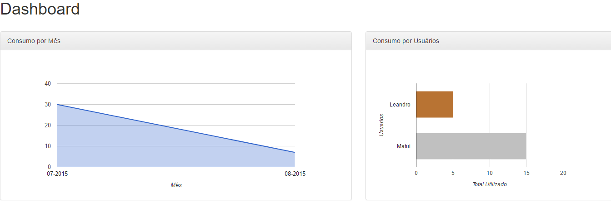
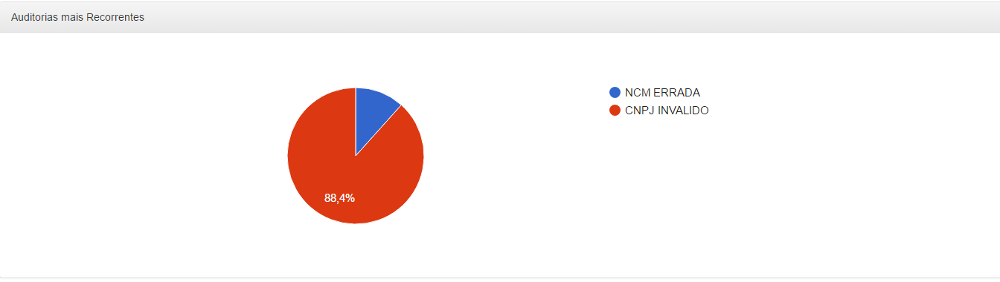

# GoogleChartInAngularJS

Este Projeto tem por Objectivo mostrar a utilizacao de Graficos Do Google Api URL https://developers.google.com/chart/ junto com o AngularJs.

No pacote **com.webservice.graficos** estão disponiveis as classes necessarias que serao necessarias para criar o JSON de Retorno para o Controller do Angular renderizar os graficos do Google. 

O json de modelo para geração dos graficos esta disponivel na pagina https://developers.google.com/chart/interactive/docs/php_example#sampledatajson-file


No pacote **com.webserviceangulajs.service** a Classe **DashboardService.java** descreve os serviços que serão chamados pelo controller **dashboard-controller.js** . 

A pagina **dashboard.html** voce poderá vizualizar 3 tipos de graficos que poderão ser criados como mostrado na figura abaixo: 







O grafico **Consumo por Mês** é representado pelo Json abaixo retornado do servidor. 

```javascript 

{
   "cols":
   [
      {
         "id":"Mes",
         "label":"Mes",
         "type":"string",
         "p":{

         }
      },
      {
         "id":"Quantidade Carregada",
         "label":"Quantidade Carregada",
         "type":"number",
         "p":{

         }
      }
   ],
   "rows":
   [
      {
         "c":[
            {
               "v":"07-2015"
            },
            {
               "v":30
            }
         ]
      },
      {
         "c":[
            {
               "v":"08-2015"
            },
            {
               "v":7
            }
         ]
      }
   ]
}

```


O grafico **Consumo por Usuarios** é representado pelo seguinte Json abaixo : 

```javascript 
{
   "cols":
   [
      {
         "id":"Nome",
         "label":"Nome",
         "type":"string",
         "p":{

         }
      },
      {
         "id":"Contador",
         "label":"Contador",
         "type":"number",
         "p":{

         }
      },
      {
         "type":"string",
         "p":{
            "role":"style"
         }
      }
   ],
   "rows":
   [
      {
         "c":[
            {
               "v":"Leandro"
            },
            {
               "v":5
            },
            {
               "v":"#b87333"
            }
         ]
      },
      {
         "c":[
            {
               "v":"Matui"
            },
            {
               "v":15
            },
            {
               "v":"silver"
            }
         ]
      }
   ]
}

```


O grafico **Auditorias mais Recorrentes** é representado pelo seguinte Json abaixo : 

```javascript 

{
   "cols":
   [
      {
         "id":"Auditoria",
         "label":"Auditoria",
         "type":"string",
         "p":{

         }
      },
      {
         "id":"Quantidade Carregada",
         "label":"Quantidade Carregada",
         "type":"number",
         "p":{

         }
      }
   ],
   "rows":
   [
      {
         "c":[
            {
               "v":"NCM ERRADA"
            },
            {
               "v":5
            }
         ]
      },
      {
         "c":[
            {
               "v":"CNPJ INVALIDO"
            },
            {
               "v":38
            }
         ]
      }
   ]
}

``` 


# Descrição retorno de dados Google Chart 


Os dados no Google Chart sao armazenados em tabelas. A tags "cols" é um array de colunas onde cada coluna serão colocados o label , 
tipo de dado que será devolvido e o style. Como no modelo abaixo , define "label" como "Nome" , tipo de retorno string e a tag role que define o style que representa a cor do grafico. 

```javascrit 
{
   "cols":[
      {
         "id":"Nome",
         "label":"Nome",
         "type":"string",
         "p":{
            "role":"style"
         }
      },
      {
         "id":"Contador",
         "label":"Contador",
         "type":"number",
         "p":{

         }
      }
   ]
}
```


